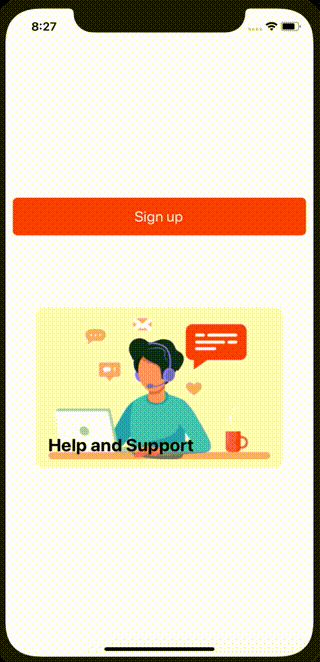

# react-native-touchable-scale-feedback
A (re)animated button with scale animation feedback. Animations work at 60fps even when js thread is busy.



## Installation
Using npm:
```
npm install react-native-reanimated (if not already)
npm install react-native-gesture-handler (if not already)
npm install react-native-touchable-scale-feedback
```
or using yarn:
```
yarn add react-native-reanimated (if not already)
yarn add react-native-gesture-handler (if not already)
yarn add react-native-touchable-scale-feedback
```

## Basic
| Prop           |     Default     |   Type   | Description                                                                                                 |
| :------------- | :-------------: | :------: | :---------------------------------------------------------------------------------------------------------- |
| onPress     |      ()=>{ }      |  `Function`  | Callback when the button is pressed |
| inactiveScale   |      1       |  `Number`  | The scale of the button when it is not pressed |
| activeScale |    0.9    | `Number` | The scale of the button when it is not pressed|

## Usage
```
import TouchableScaleFeedback from 'react-native-touchable-scale-feedback';

  ...
  <TouchableScaleFeedback
    activeScale={0.9}
    inactiveScale={1}
    onPress={()=>{console.log('Pressed')}}
  >
    // Your view here
  </TouchableScaleFeedback>


  // Example 1
  <TouchableScaleFeedback
    inactiveScale={1}
    activeScale={0.9}
    onPress={() => { console.log('Pressed') }}
  >
    <View style={styles.signupButton}>
      <Text
        style={styles.signupText}
      >
        {'Sign up'}
      </Text>
    </View>
  </TouchableScaleFeedback>

  // Example 2
  <View style={styles.card}>
    <TouchableScaleFeedback
      activeScale={1.2}
      inactiveScale={0.9}
      onPress={() => { console.log('Pressed') }}
    >
      <View style={styles.imageWrapper}>
        <Image
          style={styles.image}
          resizeMode={'contain'}
          source={SUPPORT_BACKGROUND}
        />
      </View>
    </TouchableScaleFeedback>
    <View
      pointerEvents={'none'}
      style={styles.cardAbsView}
    >
      <Text style={styles.cardTitle}>{'Help and Support'}</Text>
    </View>
  </View>
  ...

  ...
  const styles = {
    signupButton: {
      height: 52,
      borderRadius: 6,
      overflow: 'hidden',
      alignItems: 'center',
      marginHorizontal: 10,
      justifyContent: 'center',
      backgroundColor: '#FF403B',
    },
    signupText: {
      color: 'white',
      fontSize: 20
    },
    card: {
      width: '80%',
      aspectRatio: 1.5,
      marginTop: 100,
      borderRadius: 10,
      overflow: 'hidden',
      alignSelf: 'center',
      backgroundColor: '#FFF8E7'
    },
    cardAbsView: {
      top: 0,
      left: 0,
      right: 0,
      bottom: 0,
      padding: 16,
      position: 'absolute',
      justifyContent: 'flex-end'
    },
    cardTitle: {
      fontSize: 24,
      fontWeight: 'bold'
    },
    imageWrapper: {
      width: '100%',
      height: '100%'
    },
    image: {
      flex: 1,
      width: null,
      height: null,
    }
  }
  ...
```
